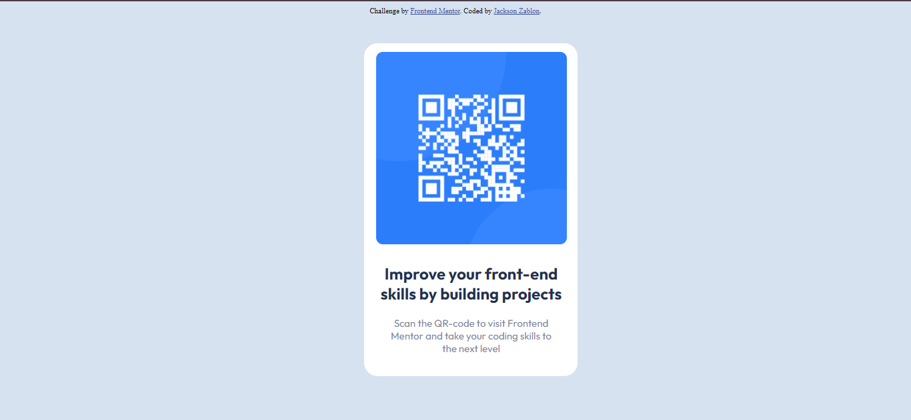
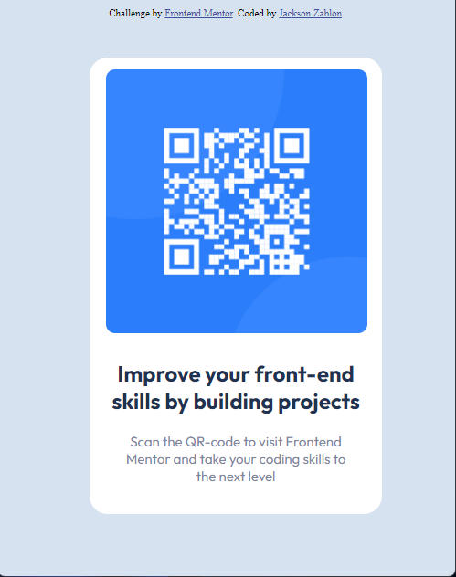

## Table of contents

- [Overview](#overview)
  - [Screenshot](#screenshot)
  - [Links](#links)
- [My process](#my-process)
  - [Built with](#built-with)
  - [What I learned](#what-i-learned)
  - [Continued development](#continued-development)
  - [Useful resources](#useful-resources)
- [Author](#author)
- [Acknowledgments](#acknowledgments)


## Overview
This is a solution to the [QR code component challenge on Frontend Mentor](https://www.frontendmentor.io/challenges/qr-code-component-iux_sIO_H). Frontend Mentor challenges help you improve your coding skills by building realistic projects.
### Screenshot
This is the screenshot for the desktop preview


This is the screenshot for the mobile preview



### Links

- Solution URL: [Add solution URL here](https://your-solution-url.com)
- Live Site URL: [Add live site URL here](https://your-live-site-url.com)

## My process

### Built with

- Semantic HTML5 markup
- CSS custom properties
- Flexbox
- CSS responsive using media queries

### What I learned

I learned how to arrange containers based on the design. The following code snippets shows how i arranged the containers
```html
<div class="container">
  <div class="image">

  </div>

  <div class="text">
<h2>Improve your front-end skills by building projects</h2>
<p>Scan the QR-code to visit Frontend Mentor and take your coding skills to the next level</p>
  </div>
</div>
```

I practice using flex to arrange the containers. The following css snippets shows how i used css flex
```css
.container {
  display: flex;
  flex-direction: column;
  justify-content: center;
}
```
I also practiced achieving responsiveness by using media queries. The following code shows how i used media query.
```css
  @media only screen and (min-width: 600px) {
.container{
  position: absolute;
  left: 40%;
}
  }
```

### Continued development
After doing this project, i want to focus more on arranging propely the containers by position properties. Also iam focusing more on using padding and margin to arrange images and text well.
On future projects i will focus more on using flex and grid on developing website layout


### Useful resources

- [w3 css tutorial](https://www.w3schools.com/css/css_intro.asp) - This helped me to understand different concepts on css that i applied in my project.

## Author
- Frontend Mentor - [@Jackson-zablon15](https://www.frontendmentor.io/home)

## Acknowledgments
I would like to extend my sincere gratitude to frontendmentor that provided the designs for this project and their articles on the learning path Getting Started On Frontend Mentor that gave me direction in each step